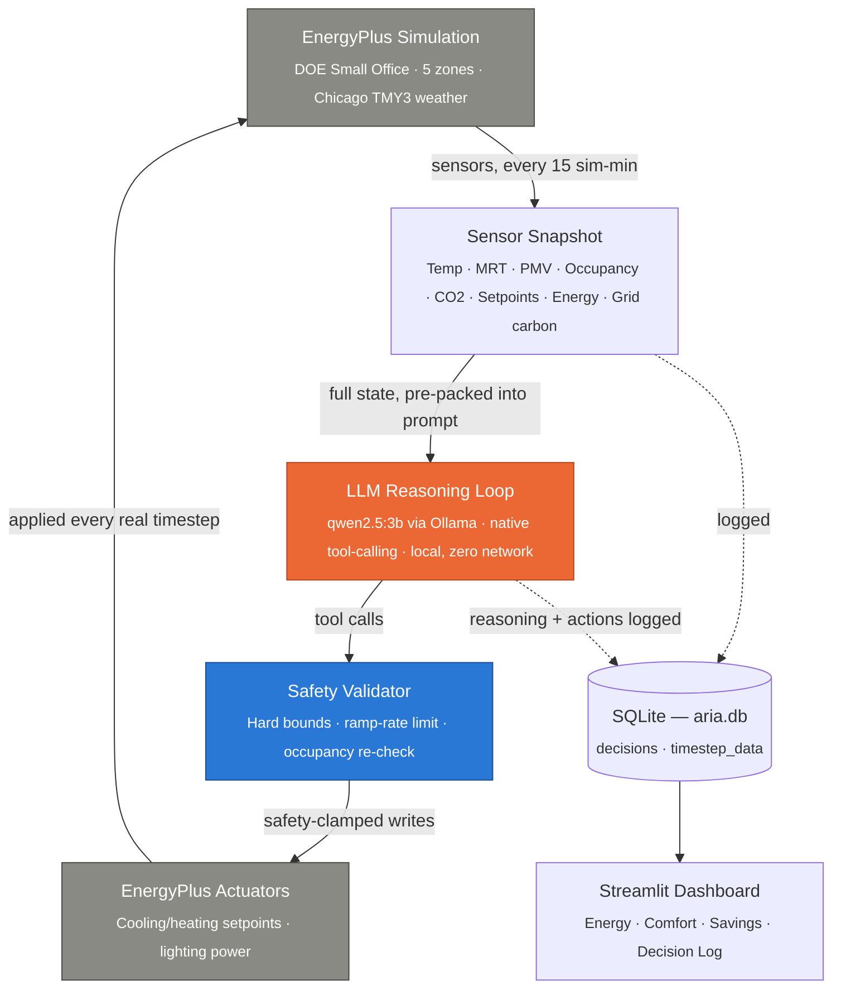

# ARIA — System Architecture

**Eco-Loop Building Agent · Honeywell Hackathon 2026**
Prepared by Konepalli Harshavardhan

> For the project overview, see [`README.md`](README.md). For how every piece
> of this was actually verified — including the real bugs found along the
> way — see [`TESTING.md`](TESTING.md).

---

## 1. System Flow

ARIA is a closed control loop between four independent systems: a physics
simulation, a local reasoning engine, a safety gate, and a persistence/
visualization layer. No component in this loop depends on an external
network service.

**Every 15 simulated minutes** (672 times across a 7-day run): EnergyPlus
advances one real timestep → ARIA reads a complete sensor snapshot → the
LLM reasons over it and proposes actions via tool calls → the safety
validator clamps every proposed value to a hard-coded safe range → the
clamped values are written back to the real actuators before the next
timestep begins. Every cycle, regardless of what the model did or didn't
call, is logged to `aria.db`.

---

## 2. Component Responsibilities

| Component | Responsibility |
|---|---|
| `simulation/energyplus_env.py` | EnergyPlus data-exchange wrapper — reads every sensor and writes every actuator each real timestep |
| `simulation/handle_registry.py` | Resolves and validates every sensor/actuator handle at startup; hard-fails the run if any is invalid |
| `simulation/state_manager.py` | Thread-safe handoff between the EnergyPlus callback thread and the reasoning/dashboard layers |
| `agent/aria_agent.py` | The Ollama tool-calling decision loop and the guaranteed-audit-trail mechanism |
| `agent/tool_registry.py` | The 4 agentic tools and their JSON schemas |
| `agent/safety_validator.py` | Hard-coded, config-independent safety bounds gate |
| `agent/fallback_handler.py` | Last-known-good setpoints for when an LLM cycle fails outright |
| `comfort/pmv.py` | ISO 7730 Fanger PMV/PPD comfort model, implemented from first principles |
| `carbon/grid_intensity.py` | Live Electricity Maps API integration, or a time-of-day mock profile |
| `data/database.py` | SQLite persistence for both the ARIA run and the baseline run |
| `dashboard/` | Streamlit + Plotly visualization across four panels |

---

## 3. Custom Agentic Tools (Not MCP)

The problem statement offered a choice: "Implement an MCP Server or custom
agentic tools." ARIA implements the latter — tools are plain JSON schemas
called directly through Ollama's native function-calling API, with no
JSON-RPC/MCP protocol layer to secure or maintain.

| Tool | Purpose | Notes |
|---|---|---|
| `set_hvac_setpoint` | Adjust cooling/heating setpoints for one or more zones | Accepts a batched `zones` array — every zone needing a change in a single call |
| `set_lighting_level` | Set lighting fraction (0.0–1.0) for one or more zones | Also batchable; occupied zones floored at 0.2 |
| `schedule_precool` | Schedule a building-wide precooling event | Used ahead of high-carbon or high-demand periods |
| `log_decision` | Record reasoning and actions taken | Required every cycle; enforced by software if the model omits it |

**Why batching mattered.** An early design called `set_hvac_setpoint` once
per zone. Measured against the live model, that produced a **46.0s average
cycle** and a **52% fallback rate** — the model was spending its entire time
budget on repeated round-trips, each carrying the full growing conversation
history. Redesigning both setpoint tools to accept a `zones` array, plus an
explicit "use as few tool calls as possible" system-prompt instruction, cut
the average cycle to **31.9s** and the fallback rate to **19%** — roughly
halving latency and reducing failures by 2.7x, from one architectural
change, not a faster model.

---

## 4. Reasoning & Priority Hierarchy

Every decision cycle is bound by a strict, non-negotiable priority order,
enforced in the system prompt:

| Priority | Goal | Definition |
|---|---|---|
| 1 | **Safety** | Zone temperature stays within hard bounds. Zero exceptions. |
| 2 | **Comfort** | PMV within [-0.5, +0.5] in all occupied zones. |
| 3 | **Carbon** | Prefer low-grid-carbon actions once 1 and 2 are satisfied. |
| 4 | **Energy** | Minimize kWh once 1, 2, and 3 are all satisfied. |

All current sensor data is pre-packed directly into the prompt every
cycle — the model never issues a "read sensor" tool call of its own; it
reasons over data it already has and acts. Temperature is fixed at 0.1 for
near-deterministic control decisions.

**Carbon-aware strategy selection**, driven by real (or realistically
mocked) grid intensity:

| Strategy | Trigger | Action |
|---|---|---|
| `DEFER` | Grid carbon > 350 gCO2/kWh | Avoid non-essential cooling |
| `PRECOOL` | Grid carbon < 120 gCO2/kWh | Pre-cool thermal mass while power is clean |
| `NORMAL` | Between thresholds | Optimize for comfort and energy as usual |

---

## 5. The Real 7-Day Run — 6 Hours 40 Minutes, Start to Finish

This is the number we're proudest of, because it's the difference between
a demo and a system: **the complete 672-cycle, 7-day evaluation run took 6
hours and 40 minutes of continuous, real, local LLM inference** — every
single one of those 672 decisions was a genuine round-trip to qwen2.5:3b
running on local hardware, reasoning over real EnergyPlus physics, with no
shortcuts, no batching-across-cycles, and no mocked reasoning.

What that duration actually represents:

- **672 real decision cycles**, one every 15 simulated minutes, spanning
  July 1st through July 7th of the simulated year, back to back, with no
  restarts.
- **Zero crashes** across the entire run — the loop that had to survive
  6h40m unattended is the same closed loop described in Section 1, running
  exactly as designed under real, sustained load rather than a short
  synthetic test.
- **A real bug was found live, mid-run**, by auditing the accumulating
  database rather than waiting for the run to finish (the occupancy-
  transition safety-net gap — see [`TESTING.md`](TESTING.md)). The fix was
  deployed for all future runs, but the live run itself was **not**
  restarted — restarting would have discarded several hours of real,
  already-valid computed data over a gap already confirmed non-dangerous.
  We let it finish and reported the tradeoff plainly rather than quietly
  re-running for a "cleaner" number.
- **Local hardware, sustained.** Running EnergyPlus's physics engine and a
  3B-parameter local LLM continuously, back-to-back, for 6h40m straight is
  meaningfully more demanding on a single machine than a short demo run —
  see [`TESTING.md`](TESTING.md) for how this stressed the system and what
  we watched for because of it.

The baseline comparison run (no AI, pure physics, no LLM calls) completed
in under 2 seconds for the same 672 timesteps — the 6h40m figure belongs
entirely to real, live model reasoning, not simulation compute.

---

## 6. Building Model & EnergyPlus Integration

- **Model:** DOE Small Office reference building — 4 perimeter zones + 1
  core zone — simulated against a real Chicago TMY3 weather file.
- **Live actuator control** reads every sensor and writes every actuator
  through EnergyPlus's real-time data exchange API each timestep — no
  static schedule edits.
- **CO2 physics is fully simulated** (`ZoneAirContaminantBalance`), not
  mocked.
- **Lighting control** goes through each zone's real electrical actuator,
  scaled by that zone's actual design wattage.
- `scripts/export_aria_idf.py` additionally produces a static
  `ARIA_Optimized.idf` snapshot with ARIA's converged setpoints baked into
  the building model's schedules, as a secondary, portable deliverable —
  the live actuator API remains the primary control mechanism.

---

## 7. Real Bugs Found and Fixed During Development

Every item below was caught by actually running EnergyPlus and the real
LLM — not by code review. Full incident-by-incident writeups, including
root cause and how each was confirmed fixed, are in
[`TESTING.md`](TESTING.md) and [`docs/CHALLENGES.md`](docs/CHALLENGES.md).

1. `request_variable()` doesn't register handles at runtime in this
   EnergyPlus build — every sensor had to be declared statically in the IDF.
2. `get_actuator_handle`'s real argument order is
   `(state, component_type, control_type, actuator_key)`, not the order
   originally planned.
3. A `raise` inside an EnergyPlus ctypes callback is silently swallowed —
   fixed with a flag checked after `run_energyplus()` returns.
4. `SimulationControl`'s "Run Simulation for Weather File Run Periods" was
   `NO` in the base IDF — the real weather-driven period had never executed
   in any earlier test. The single most significant finding of the build.
5. `get_actuator_value()` on setpoint actuators only reflects a value ARIA
   itself wrote — display now reads dedicated report variables instead.
6. The safety validator's ramp-rate clamp could override the absolute
   safety bounds on an occupancy transition — fixed by re-clamping to
   absolute bounds after the ramp-rate clamp.
7. A missing/malformed tool argument from the model crashed the whole
   decision cycle — fixed with defaults and per-tool error isolation.
8. EnergyPlus's `minutes()` can exceed 60 — fixed with real modulo
   arithmetic instead of a single `==60` special case.
9. No true per-zone CO2 or occupant-count variables exist in the base
   model — fixed by enabling real CO2 physics and reading the shared
   occupancy schedule honestly rather than faking per-zone granularity.
10. A zone's setpoint could briefly outlive its occupancy state — found
    live during the real 7-day run (see Section 5) and fixed with a
    continuous occupancy-state re-validation pass every tick.

---

## 8. Known Simplifications

Stated plainly, not hidden:

- **PMV uses fixed comfort assumptions** (50% RH, 0.1 m/s air speed, 1.2
  met, 0.5 clo) — this EnergyPlus build doesn't sense per-zone humidity or
  air velocity.
- **Occupancy is a shared 0–1 schedule fraction**, not a true per-zone
  occupant count — accurate to how this DOE prototype model is built.
- **Cost and CO2-avoided figures are estimates** from assumed constants
  ($0.15/kWh, a mock grid-average) — only energy (kWh) is directly measured.

---

*Continue to [`TESTING.md`](TESTING.md) for the full verification story, or
back to [`README.md`](README.md) for the project overview.*
